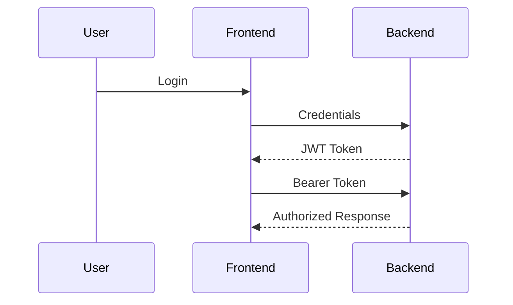
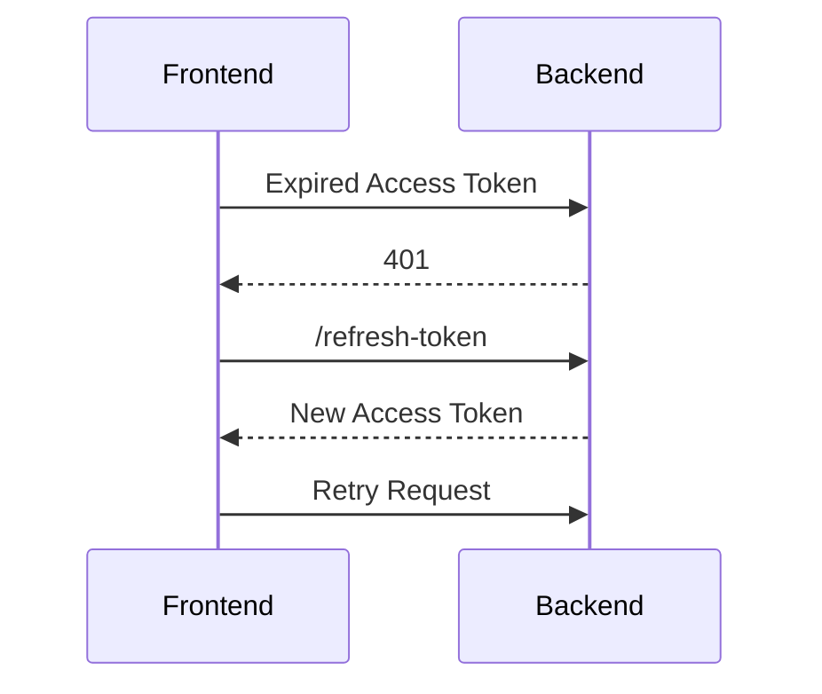
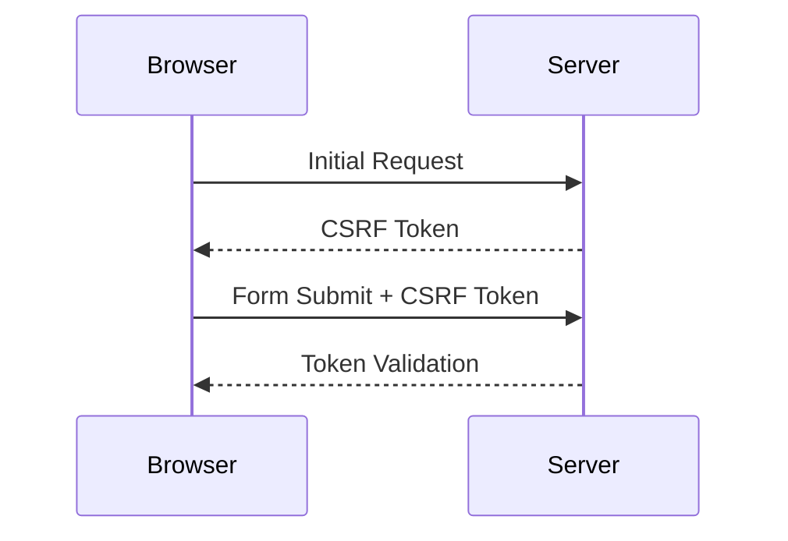

# 🔐 Frontend & Web Security Handbook

> A practical, interview-ready, and real-world guide for modern frontend and full-stack security concepts including XSS, CSRF, Authentication, Authorization, CORS, HTTPS, SSRF, CSP, Secure Cookies, Iframe Protection, Dependency Security, and more.
> Based on your original notes without removing any topics.

---

# 📚 Table of Contents

- [Security Fundamentals](#-security-fundamentals)
- [DOM Sanitization](#-dom-sanitization)
- [Input Validation](#-input-validation)
- [Authentication vs Authorization](#-authentication-vs-authorization)
- [JWT & Secure Token Storage](#-jwt--secure-token-storage)
- [Client-Side Security](#-client-side-security)
- [XSS (Cross-Site Scripting)](#-xss-cross-site-scripting)
- [CSRF (Cross-Site Request Forgery)](#-csrf-cross-site-request-forgery)
- [CORS](#-cors-cross-origin-resource-sharing)
- [HTTPS & TLS](#-https--tls)
- [Dependency Security](#-dependency-security)
- [Server-Side JavaScript Injection (SSJI)](#-server-side-javascript-injection-ssji)
- [SQL Injection](#-sql-injection)
- [SSRF (Server-Side Request Forgery)](#-ssrf-server-side-request-forgery)
- [Subresource Integrity (SRI)](#-subresource-integrity-sri)
- [Content Security Policy (CSP)](#-content-security-policy-csp)
- [Permission Policy](#-permission-policy)
- [Iframe Security](#-iframe-security)
- [Security Headers](#-security-headers)
- [Compliance & Regulations](#-compliance--regulations)
- [Real-World Vulnerabilities](#-real-world-vulnerabilities)
- [Frontend Security Checklist](#-frontend-security-checklist)

---

# 🛡️ Security Fundamentals

Modern web applications face threats from:

- Malicious scripts
- Token theft
- Session hijacking
- Unauthorized API access
- Dependency vulnerabilities
- Browser attacks
- Third-party integrations
- Unsafe user input

---

# 🧼 DOM Sanitization

> DOM Sanitization is the process of cleaning potentially dangerous HTML, JavaScript, or CSS before inserting it into the DOM.

---

# 🚨 Why It Matters

Without sanitization, attackers can inject scripts into your application.

---

# ❌ Unsafe Example

```js id="xssbad1"
const userInput = "";

document.getElementById("comments").innerHTML = userInput;
```

---

# ✅ Safe Approaches

## Prefer `textContent`

```js id="textsafe1"
element.textContent = userInput;
```

---

## Use DOMPurify

```js id="dompurify1"
const clean = DOMPurify.sanitize(userInput);

document.getElementById("comments").innerHTML = clean;
```

---

# 🅰️ Angular Sanitization

Angular automatically sanitizes:

- `[innerHTML]`
- `href`
- `src`
- `style`

---

## DomSanitizer

```ts id="angularsafe1"
constructor(private sanitizer: DomSanitizer) {}

safeHtml = this.sanitizer.bypassSecurityTrustHtml(userInput);
```

⚠️ Use `bypassSecurityTrustHtml()` carefully.

---

# ✅ Best Practices

- Prefer `textContent`
- Never trust user input
- Sanitize on frontend + backend
- Use trusted libraries like DOMPurify

---

# ✅ Input Validation

> Validate all user input before processing.

---

# 📋 Validation Techniques

| Technique            | Example                    |
| -------------------- | -------------------------- |
| Required Validation  | `required`                 |
| Regex Validation     | `/^\d{10}$/`               |
| Length Validation    | `minLength`, `maxLength`   |
| Type Validation      | string, number             |
| MIME Validation      | image/jpeg                 |
| Whitelist Validation | Allow only expected fields |

---

# ✅ Angular Example

```html id="angularform1"
<input required minlength="3" />
```

---

# ✅ Regex Example

```js id="regex1"
const emailRegex = /^[\w-.]+@([\w-]+\.)+[\w-]{2,4}$/;
```

---

# ✅ File Validation

Validate:

- File size
- MIME type
- Extension
- Upload limits

---

# 🔐 Authentication vs Authorization

| Term           | Meaning              |
| -------------- | -------------------- |
| Authentication | Who are you?         |
| Authorization  | What can you access? |

---

# 🔄 Typical Flow



---

# 🔑 JWT & Secure Token Storage

---

# ✅ Recommended Strategy

| Token         | Storage         |
| ------------- | --------------- |
| Access Token  | Memory          |
| Refresh Token | HttpOnly Cookie |

---

# 🍪 Secure Cookie Example

```js id="cookie1"
res.cookie("token", jwtToken, {
  httpOnly: true,
  secure: true,
  sameSite: "Strict",
  maxAge: 15 * 60 * 1000,
});
```

---

# 🔄 Refresh Flow



---

# ✅ Important Notes

- Access token → short expiry
- Refresh token → HttpOnly cookie
- Use MFA
- Clear storage on logout
- Rotate tokens

---

# 🌐 withCredentials

## Frontend

```js id="fetchcookie1"
fetch("https://api.domain.com", {
  credentials: "include",
});
```

---

## Axios

```js id="axioscookie1"
axios.get("/api", {
  withCredentials: true,
});
```

---

## Angular Interceptor

```ts id="angularinterceptor1"
clonedRequest = req.clone({
  withCredentials: true,
});
```

---

# 🖥️ Client-Side Security

---

# 🚫 Avoid Storing Sensitive Data

Avoid storing:

- Passwords
- Refresh tokens
- Critical secrets

in:

- localStorage
- sessionStorage
- IndexedDB

---

# ✅ Best Practices

- Use HttpOnly cookies
- Encrypt data if needed
- Use checksums
- Auto logout on expiry
- Clear browser storage on logout

---

# 🔐 Encryption Example

```js id="encrypt1"
CryptoJS.AES.encrypt(data, secretKey);
```

---

# 🔥 XSS (Cross-Site Scripting)

> Attacker injects malicious JavaScript into your website.

---

# 🚨 Example

```js id="xss1"
<input value="<script>alert('Hacked')</script>" />
```

---

# ⚠️ Risks

- Cookie theft
- Session hijacking
- Keylogging
- Phishing
- Data theft

---

# 🛡️ Prevention

- DOM sanitization
- CSP headers
- Escape user input
- Avoid `eval()`
- Use frameworks (Angular/React)
- Validate input

---

# 🔒 CSP Nonce Example

```html id="nonce1"
<script nonce="randomKey">
  console.log("Trusted");
</script>
```

---

# 🔐 Content Security Policy (CSP)

> Controls which scripts/styles/assets are allowed.

---

# ✅ Why CSP Matters

- Prevents XSS
- Blocks malicious scripts
- Restricts third-party assets
- Prevents clickjacking

---

# ✅ Example

```http id="csp1"
Content-Security-Policy:
default-src 'self';
script-src 'self' https://trusted.com;
```

---

# ⚠️ Best Practices

- Avoid `unsafe-inline`
- Use nonce/hash
- Allow only trusted domains
- Prefer HTTPS sources

---

# 🔄 CSRF (Cross-Site Request Forgery)

> Another website tricks your browser into making authenticated requests.

---

# 🚨 Example

```html id="csrf1"

```

---

# ✅ Protection

- CSRF token
- SameSite cookies
- CAPTCHA
- Avoid GET for updates

---

# 🔐 CSRF Token Flow



---

# 🌍 CORS (Cross-Origin Resource Sharing)

> Browser security mechanism controlling cross-origin requests.

---

# 🔒 Same-Origin Policy

Browser blocks requests when:

- Domain differs
- Port differs
- Protocol differs

---

# ✅ Example

```http id="cors1"
Access-Control-Allow-Origin: https://client.com
Access-Control-Allow-Credentials: true
```

---

# ⚠️ Preflight Request

Browser sends:

```http id="options1"
OPTIONS /api
```

before actual request.

---

# 🔐 HTTPS & TLS

> HTTPS encrypts communication using SSL/TLS.

---

# HTTP vs HTTPS

| Feature         | HTTP | HTTPS |
| --------------- | ---- | ----- |
| Encryption      | ❌   | ✅    |
| Port            | 80   | 443   |
| Security        | Low  | High  |
| MITM Protection | ❌   | ✅    |

---

# 🔒 Why HTTPS Matters

- Encrypts data
- Prevents tampering
- Prevents eavesdropping
- Improves SEO
- Secures cookies
- Protects APIs/WebSockets

---

# 🔐 HSTS

```http id="hsts1"
Strict-Transport-Security:
max-age=31536000;
includeSubDomains;
preload
```

---

# 📦 Dependency Security

> Vulnerabilities in third-party packages can compromise your app.

---

# ⚠️ Risks

- Prototype pollution
- RCE
- Dependency hijacking
- Malicious packages

---

# ✅ Best Practices

- Use `npm audit`
- Keep dependencies updated
- Use `package-lock.json`
- Use trusted libraries only

---

# 🔍 Commands

```bash id="npm1"
npm audit
npm update
npm audit fix
```

---

# 🔥 Server-Side JavaScript Injection (SSJI)

> Server executes user input as JavaScript.

---

# ❌ Dangerous

```js id="eval1"
eval(userInput);
```

---

# ❌ Also Dangerous

```js id="eval2"
new Function(userInput);

setTimeout(userInput);
```

---

# ✅ Prevention

- Never execute user input
- Validate all input
- Avoid dynamic code execution

---

# 💉 SQL Injection

> Attacker manipulates SQL queries.

---

# ❌ Vulnerable Query

```js id="sqlbad1"
const query = `
SELECT * FROM users
WHERE username='${username}'
`;
```

---

# ✅ Safe Query

```js id="sqlsafe1"
db.query("SELECT * FROM users WHERE id=?", [userId]);
```

---

# 🌐 SSRF (Server-Side Request Forgery)

> Attacker tricks backend into making unauthorized requests.

---

# 🚨 Dangerous Example

```js id="ssrf1"
fetch(req.query.url);
```

---

# ⚠️ Risks

- AWS metadata theft
- Internal service access
- Port scanning
- RCE
- Data exfiltration

---

# 🛡️ Prevention

- Whitelist domains
- Block internal IPs
- Disable redirects
- Validate DNS/IP
- Use timeouts

---

# ❌ Dangerous Targets

- localhost
- 127.0.0.1
- 169.254.169.254
- Internal CIDRs

---

# 🔐 Subresource Integrity (SRI)

> Browser verifies external files using cryptographic hashes.

---

# ✅ Example

```html id="sri1"
<script
  src="https://cdn.com/library.js"
  integrity="sha384-abc123"
  crossorigin="anonymous"
></script>
```

---

# ⚠️ Why SRI Matters

If CDN is hacked:

- Browser blocks modified script
- Prevents malicious code execution

---

# 🎛️ Permission Policy

> Controls browser APIs available to app/iframes.

---

# 🔒 Controls Access To

- Camera
- Microphone
- Geolocation
- Clipboard
- Bluetooth
- Payment
- Screen capture

---

# ✅ Example

```http id="permission1"
Permissions-Policy:
camera=(),
microphone=(),
geolocation=(self)
```

---

# 🖼️ Iframe Security

---

# ⚠️ Risks

- Clickjacking
- Keylogging
- Token theft
- Session hijacking
- Phishing

---

# ✅ Sandbox Example

```html id="iframe1"
<iframe
  src="https://secure.payments.com"
  sandbox="allow-scripts allow-forms"
  referrerpolicy="no-referrer"
>
</iframe>
```

---

# 🔒 CSP Frame Protection

```http id="frame1"
Content-Security-Policy:
frame-ancestors 'self';
```

---

# 🚫 Avoid

```html id="iframebad1"
allow-same-origin
```

unless iframe is fully trusted.

---

# 🔐 Security Headers

---

# ✅ Important Headers

| Header                 | Purpose               |
| ---------------------- | --------------------- |
| X-Content-Type-Options | Prevent MIME sniffing |
| Referrer-Policy        | Control referrer info |
| HSTS                   | Force HTTPS           |
| CSP                    | Restrict resources    |
| Permissions-Policy     | Restrict browser APIs |

---

# ✅ Express Example

```js id="headers1"
app.use((req, res, next) => {
  res.removeHeader("X-Powered-By");

  res.setHeader("Referrer-Policy", "origin");

  res.setHeader("X-Content-Type-Options", "nosniff");

  res.setHeader(
    "Strict-Transport-Security",
    "max-age=31536000; includeSubDomains; preload",
  );

  next();
});
```

---

# 📜 Compliance & Regulations

---

# Important Standards

| Regulation           | Purpose                 |
| -------------------- | ----------------------- |
| HIPAA                | Healthcare security     |
| GDPR                 | Privacy/data protection |
| PCI DSS              | Payment card security   |
| SOC2                 | Organizational security |
| Accessibility (A11y) | Inclusive applications  |

---

# 💣 Real-World Vulnerabilities

| Vulnerability       | Example                     |
| ------------------- | --------------------------- |
| XSS                 | `<script>alert(1)</script>` |
| SQL Injection       | `' OR 1=1 --`               |
| Prototype Pollution | `__proto__.admin=true`      |
| RCE                 | `eval(userInput)`           |
| DoS                 | Flooding requests           |
| Directory Traversal | `../../../etc/passwd`       |

---

# ✅ Frontend Security Checklist

## Input Security

- [ ] Validate user input
- [ ] Sanitize HTML
- [ ] Escape special characters
- [ ] Validate file uploads

---

## Authentication

- [ ] Use JWT/OAuth
- [ ] Use MFA
- [ ] Rotate tokens
- [ ] Store refresh tokens in HttpOnly cookies

---

## Browser Security

- [ ] Use CSP
- [ ] Use SRI
- [ ] Use HTTPS
- [ ] Use HSTS
- [ ] Configure CORS properly

---

## Dependency Security

- [ ] Run `npm audit`
- [ ] Keep dependencies updated
- [ ] Use trusted packages only
- [ ] Commit package-lock.json

---

## Iframe & Third-Party Security

- [ ] Sandbox iframes
- [ ] Use Permission Policy
- [ ] Restrict external domains
- [ ] Validate embedded URLs

---

# 🏁 Final Takeaways

| Topic            | Main Goal                     |
| ---------------- | ----------------------------- |
| XSS              | Prevent script injection      |
| CSRF             | Prevent unauthorized requests |
| HTTPS            | Encrypt communication         |
| CSP              | Restrict untrusted resources  |
| SSRF             | Prevent backend abuse         |
| CORS             | Control cross-origin access   |
| SRI              | Verify CDN integrity          |
| Security Headers | Harden browser security       |

---

# ⭐ Security Golden Rules

- Never trust user input
- Sanitize + validate everything
- Prefer allowlists over blocklists
- Use least privilege access
- Keep dependencies updated
- Use HTTPS everywhere
- Secure browser storage
- Protect APIs with proper auth
- Audit third-party integrations regularly
